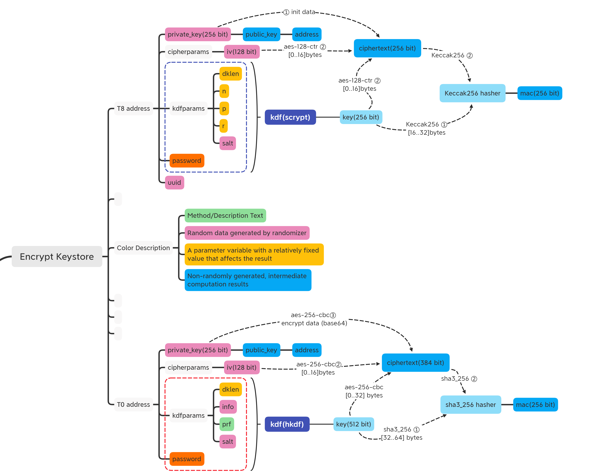

## TOP Keystore 

TOP-Chain's Keystore Crypto Tools.

### Keystore Encryption Algorithm


### Account Address Encryption Algorithm

##### T0 Address

1. get public_key: **secp256k1** `private_key(256bit) -> public_key(512bit)`
2. get hash: **sha2_256** then **rip160** `public_key(512bit) -> rip160(sha2_256(public_key)) = hash`
3. add version: char '0' or hex '0x30' `['0',hash] -> version-hash`
4. calc checksum: **sha2_256** twice `version-hash -> sha2_256(sha2_256(version-hash)) = checksum`
5. get address bytes: `[hash, checksum_hash[0..4]] -> address_bytes` 
6. get T0 address: **base58::encode** `T0_address = "T00000" + address_bytes.to_base58()`

##### T8 Address

1. get public_key: **secp256k1** `private_key(256bit) -> public_key(512bit)`
2. get hash: **keccak256** `public_key[1..] -> keccak256(public_key[1..]) = hash`
3. get eth address: `eth_address = hex::encode(hash[12..])`
4. get T8 address: `T8_address = "T80000" + eth_address`

### TOP-address


### Keystore Sample:

##### T0 address

``` JSON
{
    "account_address": "T00000LYWKqJhtPeGyBAw7WC8R3F7ovxtzAiubdM",
    "crypto": {
        "cipher": "aes-256-cbc",
        "cipherparams": {
            "iv": "0x8a84a01ee9be2e5891d218aaaf77f70d"
        },
        "ciphertext": "0x5bcd351f5cdb50c708efda4dd45e63ba93581045bcd53a92afad23edc84d58ed8db2dfacf0f5297c4c2c4f580084a090",
        "kdf": "hkdf",
        "kdfparams": {
            "dklen": 64,
            "info": "0xa5b12f992aec539c",
            "prf": "sha3-256",
            "salt": "0xa7ee105655cb7f9c54e0352a1f968db435d9d35addcde0bdab781d71b7d95e11"
        },
        "mac": "0x287153557e9bf21b54e0d7b98296e8e782c89ce092394320ac15c2836e28b63e"
    },
    "hint": "hint",
    "key_type": "owner",
    "public_key": "BHm+Zn753LusVaBilc6HCwcCm/zbLc4o2VnygVsW+BeYSDradyajxGVdpPv8DhEIqP0XtEimhVQZnEfQj/sQ1Lg="
}
```
##### T8 address

``` JSON
{
    "account_address": "T800007e5f4552091a69125d5dfcb7b8c2659029395bdf",
    "address": "7e5f4552091a69125d5dfcb7b8c2659029395bdf",
    "crypto": {
        "cipher": "aes-128-ctr",
        "cipherparams": {
            "iv": "ae46894bcda5061962976bf594f5c6f3"
        },
        "ciphertext": "cb028ef9b5d6163c924ceae987e488463ef8bfaa94e0c7cfee3c8faae9c5b6cf",
        "kdf": "scrypt",
        "kdfparams": {
            "dklen": 32,
            "n": 262144,
            "p": 1,
            "r": 8,
            "salt": "a03f8b4c0ee08399f76880aa5193e80ad6f62ab30f5474dfdfdf5de4920beff6"
        },
        "mac": "230a83dc9772cddca12b44e83237b590b52160b5ac628bbed620aa0d8a8e04a7"
    },
    "hint": "hint",
    "id": "55474959-f061-4581-ae24-a9d1ae995381",
    "key_type": "owner",
    "public_key": "BHm+Zn753LusVaBilc6HCwcCm/zbLc4o2VnygVsW+BeYSDradyajxGVdpPv8DhEIqP0XtEimhVQZnEfQj/sQ1Lg=",
    "version": 3
}
```